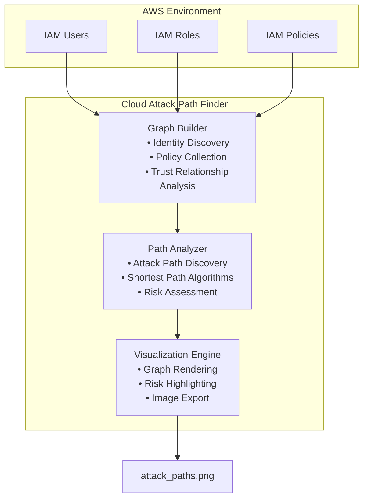

# Cloud Attack Path Finder

## AWS IAM Privilege Escalation Detection & Visualization

**Research Project by Nathaniel Dadson**
*Independent Security Researcher | Cloud Security & Graph Analytics*

---

# Overview

## The Challenge

Cloud environments continue to grow in complexity, and AWS Identity and Access Management (IAM) remains one of the most critical security control layers. While individual IAM policies may appear harmless when reviewed independently, combinations of permissions, trust relationships, and role assumptions can create unintended privilege escalation paths.

For example, a developer account may not possess administrative permissions directly, yet a sequence of allowed actions could ultimately provide access to an administrator role. Identifying these attack paths manually becomes increasingly difficult as organizations scale to hundreds or thousands of identities, roles, and policies.

Traditional IAM reviews focus on isolated permissions. Attackers, however, focus on relationships between permissions.

## Project Objective

Cloud Attack Path Finder is a graph-based security analysis tool designed to discover and visualize privilege escalation opportunities within AWS environments.

The system models IAM entities and relationships as a directed graph, then applies graph traversal and path-finding algorithms to identify potential attack paths from low-privilege identities to highly privileged roles.

The project combines cloud security concepts with graph theory to provide security teams with a practical way to understand hidden IAM risks before they can be exploited.

---

# Key Features

* Automatic AWS IAM discovery
* IAM user and role enumeration
* Trust policy analysis
* Relationship graph construction
* Privilege escalation path detection
* Risk classification and scoring
* Visual attack path representation
* Security research and educational applications
* Extensible architecture for future cloud security analysis

---

# System Architecture



---

# How It Works

The tool performs three major phases:

## 1. Identity Discovery

The Graph Builder collects information about:

* IAM Users
* IAM Roles
* Attached Policies
* Trust Relationships
* Instance Profiles

Each discovered entity becomes a node within the graph.

---

## 2. Relationship Mapping

The system analyzes permissions and trust policies to determine how identities can interact.

Examples include:

* Role Assumption
* PassRole Permissions
* Service Trust Relationships
* Resource Access Permissions

These interactions become graph edges.

Example:

```text
Developer User
    ── can_assume ──► Lambda Role

Lambda Role
    ── can_pass_role ──► EC2 Instance

EC2 Instance
    ── has_instance_profile ──► Admin Role
```

---

## 3. Attack Path Discovery

Once the graph is built, graph traversal algorithms identify potential privilege escalation routes.

The objective is to answer:

> "Can a low-privilege identity eventually reach administrative privileges through a sequence of allowed actions?"

If the answer is yes, the path is reported and visualized.

---

# Example Privilege Escalation Scenario

```text
User: developer@example.com

    → can_assume
      lambda-execution-role

    → can_pass_role
      ec2-instance

    → has_instance_profile
      admin-role
```

### Result

```text
Privilege Escalation Detected

Path Length: 3

developer@example.com
    ↓
lambda-execution-role
    ↓
ec2-instance
    ↓
admin-role
```

This attack path demonstrates how seemingly unrelated permissions can combine to create a route to administrative access.

---

# Graph Theory Application

Cloud Attack Path Finder leverages graph analytics to model security relationships.

### Nodes

Nodes represent AWS entities such as:

* IAM Users
* IAM Roles
* IAM Groups
* AWS Services
* Resources

### Edges

Edges represent relationships including:

* can_assume
* can_pass_role
* can_access
* service_can_assume
* member_of

### Algorithms

The project utilizes:

* Breadth-First Search (BFS)
* Shortest Path Analysis
* Directed Graph Traversal
* Reachability Analysis

These techniques enable efficient identification of attack paths even in large IAM environments.

---

# Technology Stack

| Component        | Technology  |
| ---------------- | ----------- |
| Language         | Python 3.9+ |
| Cloud Platform   | AWS         |
| Graph Processing | NetworkX    |
| Visualization    | Matplotlib  |
| AWS Integration  | Boto3       |
| Authentication   | AWS CLI     |

---

# Prerequisites

| Requirement | Version             |
| ----------- | ------------------- |
| Python      | 3.9+                |
| AWS CLI     | 2.x+                |
| AWS Account | Free Tier Supported |

---

# Installation

```bash
git clone https://github.com/natedadson/cloud-attack-path-finder.git

cd cloud-attack-path-finder

python3 -m venv venv

source venv/bin/activate

pip install -r requirements.txt

aws configure --profile cloud-attack-path-finder
```

---

# Usage

## Build the IAM Graph

```bash
python src/graph/iam_graph.py
```

## Visualize Relationships

```bash
python src/visualization/graph_viz.py
```

---

# Sample Output

```text
============================================================
Building IAM Privilege Graph
============================================================

Discovering IAM users...
✓ Found 1 IAM user

Discovering IAM roles...
✓ Found 2 IAM roles

============================================================
Graph Statistics
============================================================

Total Nodes: 4
Total Edges: 2

============================================================
Privilege Escalation Analysis
============================================================

✓ No privilege escalation paths found

Graph saved to iam_graph.gpickle
Graph saved to iam_graph.png
```

---

# Project Structure

```text
cloud-attack-path-finder/

├── README.md
├── requirements.txt
├── .gitignore

├── src/
│   ├── graph/
│   │   └── iam_graph.py
│   │
│   ├── analysis/
│   │   └── path_finder.py
│   │
│   └── visualization/
│       └── graph_viz.py

├── tests/
├── data/
└── outputs/
```

---

# Risk Classification

| Risk Level | Relationship Type  | Example           |
| ---------- | ------------------ | ----------------- |
| High       | can_assume         | User → Admin Role |
| Medium     | service_can_assume | Lambda → Role     |
| Low        | can_access         | Role → S3 Bucket  |

---

# Security Research Contributions

This project explores the intersection of:

* Cloud Security
* IAM Governance
* Attack Path Analysis
* Graph Analytics
* Security Visualization
* Privilege Escalation Detection

The long-term goal is to contribute practical methods for identifying toxic permission combinations and hidden escalation routes within cloud environments.

---

# Development Roadmap

| Feature                         | Status            |
| ------------------------------- | ----------------- |
| IAM Graph Builder               | ✅ Complete        |
| Trust Relationship Detection    | ✅ Complete        |
| Visualization Engine            | ✅ Complete        |
| Multi-Step Attack Path Analysis | 🚧 In Development |
| Risk Scoring Engine             | 📅 Planned        |
| Remediation Recommendations     | 📅 Planned        |
| Toxic Combination Detection     | 📅 Planned        |
| Multi-Account Analysis          | 📅 Planned        |
| AWS Organizations Support       | 📅 Planned        |

---

# Future Research

This project serves as a foundation for future research in cloud security and graph analytics.

---

# License

MIT License

---

# Author

**Nathaniel Dadson**

Independent Security Researcher
Cloud Security • Identity Security • Graph Analytics

GitHub: https://github.com/natedadson

This project is conducted as independent research and is not affiliated with any employer, organization, or institution.

---

# Last Updated

June 2026
